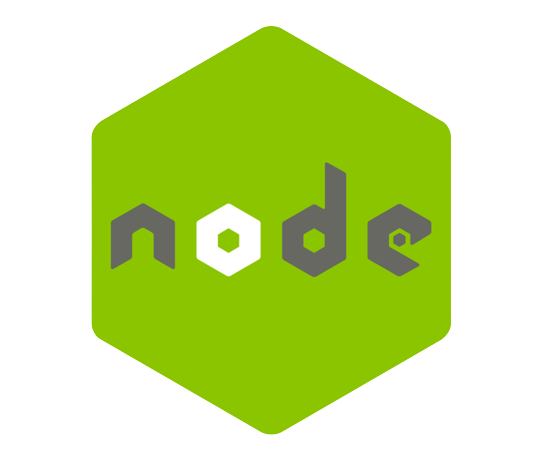

<h1 align="center">
  
</h1>


<h5 align="center">A minimal chat application that can be used as an internal asset for any organization that wants its employees to be connected internally.</h5>

<h6>
    <p align="center">
       	<a href="#key-features">Features</a> •
  		<a href="#technologies-used">Technologies Used</a> •
  		<a href="https://github.com/bu-sce/Chat-Application#how-to-use-pencil">How To Use</a> •
  		<a href="https://github.com/bu-sce/Chat-Application#demo-robot">Demo</a> •
 		<a href="#team">Team</a> •
  		<a href="https://github.com/bu-sce/Chat-Application#license-bookmark">License</a>    
	</p>
</h6>


## Key Features

- Free real-time Messaging app with Unlimited Chats.
- Chat with whoever on the app
- Every user can set an avatar on signup and can change it later at any time
- 

## Technologies Used

<p align="center">
	
	
	
	
    
    
    
    
    
    
    </p>


## How To Use :pencil:

To clone and run this application, you'll need [Git](https://git-scm.com/) and [Node.js](https://nodejs.org/en/download/) (which comes with [npm](http://npmjs.com/)) installed on your computer. From your command line:

```bash
# Clone this repository
$ git clone https://github.com/bu-sce/Chat-Application.git
```

Now to get the server up and running follow these steps:

```bash
$ cd Chat-Application/server
$ npm i           # to install all the needed dependencies
$ npm run build   # to build the js files from the ts files
$ npm run dev     # to get the server up and running
```

Once the server is up now you can initiate the frontend of the application:

```bash
$ cd Chat-Application/public
$ npm i           # to install all the needed dependencies
$ npm start
```

> the application will be up and running at http://localhost:3000/

## Demo :robot:

If You don't wanna try it locally, don't worry, We got you covered.

This application is now up and running on <<<>>>>, Go give it a check.

## Team
This project was created with all the love and passion from the following talented people :heart:
<table>
  <tr>
    <td align="center"><a href="https://github.com/ammaradel17"><br /><sub><b>Ammar Adel</b></sub></a><br /></td>
    <td align="center"><a href="https://github.com/A-bahaa"><br /><sub><b>Ahmed Bahaa</b></sub></a><br /></td>
    <td align="center"><a href="https://github.com/Shrouk-Abdullah"><br/><sub><b>Shrouk Abdullah</b></sub></a><br /></td>
    <td align="center"><a href="https://github.com/abdelrahman-Sayed-abdelhamid"><br /><sub><b>Abdulrahman Sayed
</b></sub></a><br /></td>
    <td align="center"><a href="https://github.com/karim-moftah"><br /><sub><b>Karim Moftah</b></sub></a><br /></td>
    <td align="center"><a href="https://github.com/BU9D4DDY"><br /><sub><b>Diaa Hassan</b></sub></a><br /></td>
    </tr>
</table>

## License :bookmark:

Distributed under the MIT License. See `LICENSE.txt` for more information.
